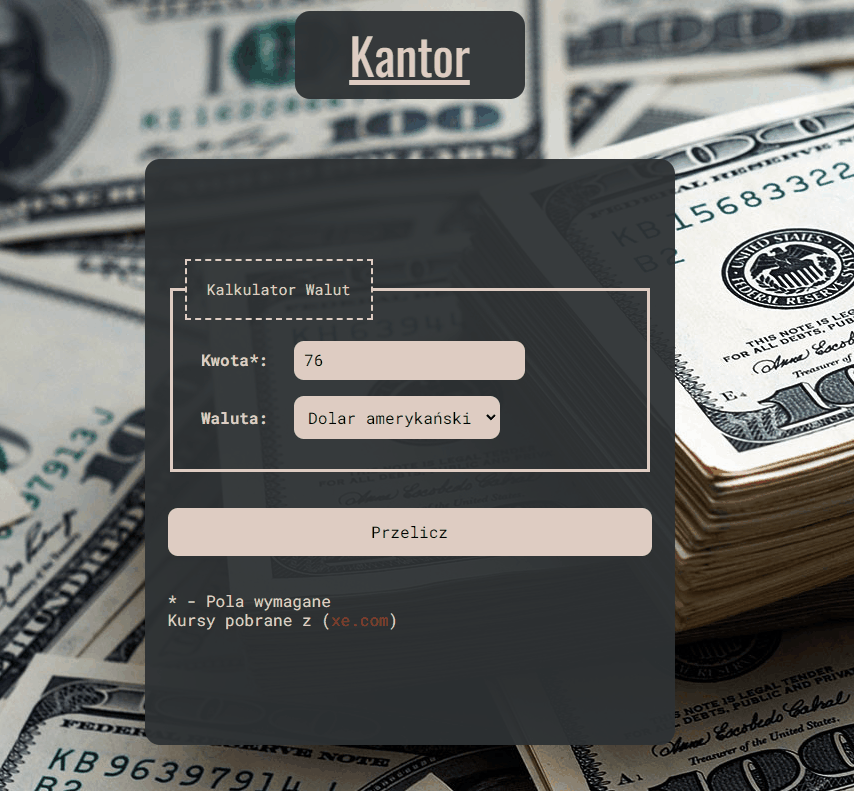

# Currency Converter


## About project

Currency-Converter is a simple calculator to convert currencies with fixed values.

Demo: [click here!](https://siedemus.github.io/Currency-Converter/)

## Currencies
In my converter you can convert PLN to:
- GPB
- USD
- EURO
- CHF

Each currency has been taken from [xe.com](https://www.xe.com/)

## How it works



## Some code

This function convert PLN to currency set by user

```
    const calculateResult = (select, field) => {
        switch (select) {
            case "USD":
                return field * USD;
            case "GPB":
                return field * GPB;
            case "EUR":
                return field * EUR;
            case "CHF":
                return field * CHF;
        };
    };
```
Here, we have JS variables which contains prices of currencies

`let USD = 0.21245696;`

`let EUR = 0.21287202;`

`let GPB = 0.18693312;`

`let CHF = 0.21159223;`

## Soon

- More currencies
- Variable currencies

## Technologies I used

- HTML
- CSS
- JavaScript
- BEM
- Normalise.css
